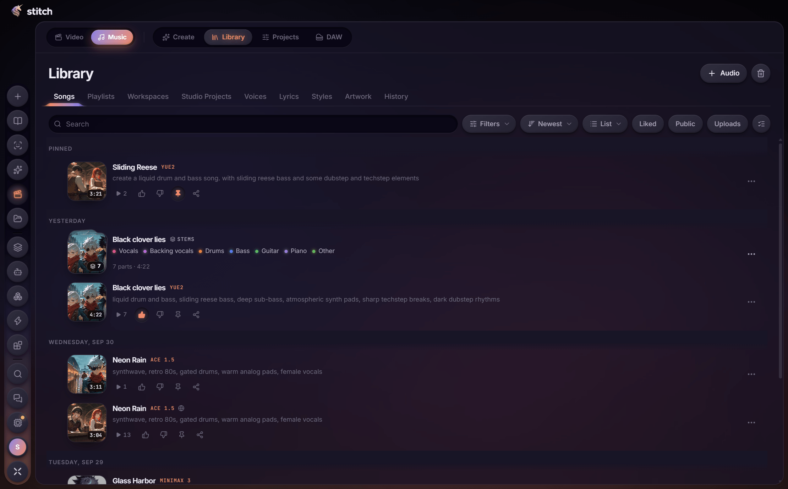
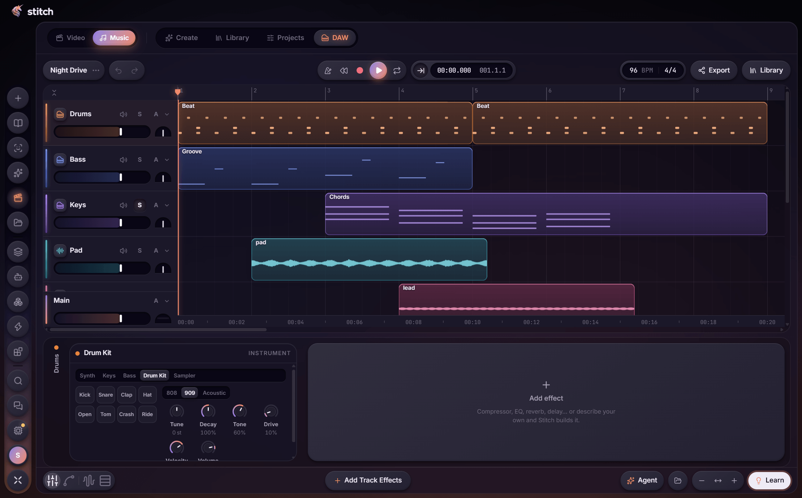
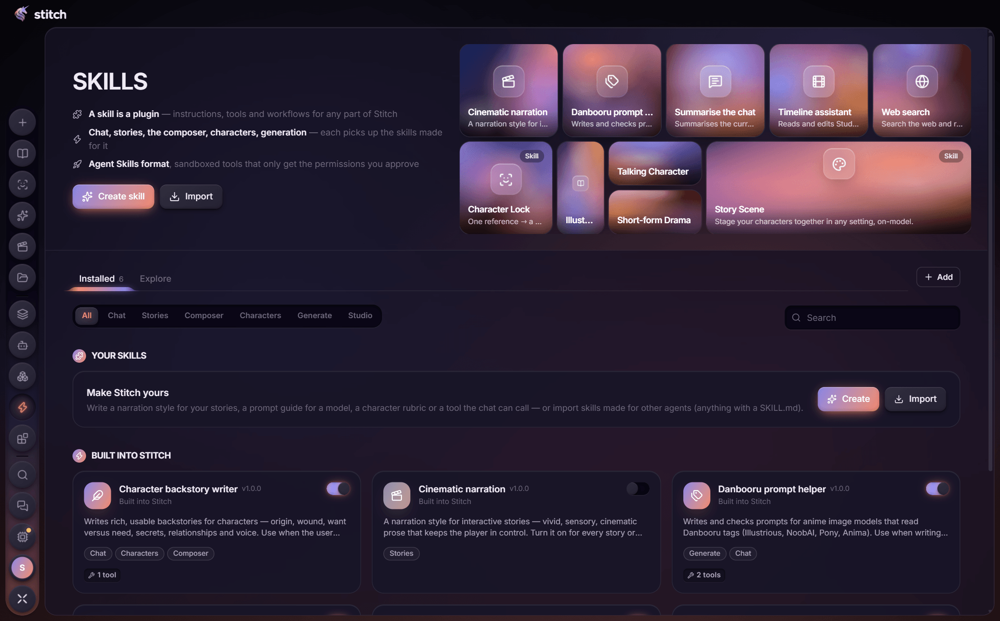

  <picture>
    <source media="(prefers-color-scheme: dark)" srcset="docs/logo-dark.png">
    
  </picture>

<b>Your own AI studio and storyteller, running on your PC.</b>

  <a href="https://github.com/Darker117/stitch-releases/releases/latest"><b>⬇ Download for Windows</b></a> · <a href="https://github.com/Darker117/stitch-releases/releases/latest"><b>Android app</b></a>

  

## What is Stitch?

Stitch puts a whole creative studio in one desktop app, running on your own graphics card:

- **Stories that see, speak and move.** Play interactive adventures that illustrate every turn, letter the dialogue into speech bubbles, animate scenes into clips and read each line in the right character's voice.
- **Characters that stay themselves.** Create a character once and they look and sound the same in every picture, clip, voice line and story.
- **A studio for everything else.** Images, video, voices and full songs. There's also a video editor and a music studio with stem splitting and a DAW, whose effects Stitch can write for you.
- **Talk to it, or hand it the work.** Chat or voice-chat with Stitch, or give an agent a task and let it run the app for you.
- **Make it yours.** Add skills (plug-ins for any part of Stitch), import Chub.ai character cards, and pick themes or live wallpapers.

Your characters, stories and creations stay on your machine. Got more than one PC? Link them and Stitch shares the work.

## Download

Get the latest installer from the [**Releases**](https://github.com/Darker117/stitch-releases/releases/latest) page and run `Stitch-Setup-<version>.exe`.

Stitch keeps itself up to date: when a new version comes out it downloads in the background and asks before restarting.

> Windows may show a SmartScreen warning because the installer isn't signed yet. Choose **More info → Run anyway**.

You'll need Windows 10 or 11 and an NVIDIA graphics card.

## Stitch on your phone

The Android app is a remote for Stitch on your PC: chats, stories, characters and generations all run on your graphics card and stay in your library. The phone just drives it, with the same look and every feature.

- **Install:** download `Stitch-Android-<version>.apk` from the [**Releases**](https://github.com/Darker117/stitch-releases/releases/latest) page on your phone and open it (allow installing from your browser when Android asks).
- **Pair once:** in Stitch on the PC, open **Settings → Phone → Pair a phone** and scan the QR code.
- **Use it anywhere:** at home it talks to your PC over Wi-Fi. Turn on **Access from anywhere** to keep going on mobile data, or connect straight to your PC's own Wi-Fi when there's no internet.
- **Make things on the phone too:** text, images and voice can also run on the phone itself, so your stories keep working away from your PC and sync back when it's reachable again.

## A look inside

| | |
|:---:|:---:|
|  Ask for anything, or start from a quick idea |  Pick up a story where you left it |
|  Characters that stay on-model everywhere |  Make songs and split them into stems |
|  Finish them in the built-in DAW |  Skills add new abilities to any part of Stitch |

---

This repository only hosts Stitch's releases: the installers, the Android app and the release notes. Installed copies of Stitch update from here.
